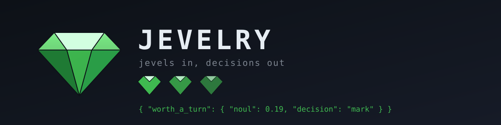

<p align="center">
  <a href="#start">Start</a> ·
  <a href="#jevels">Jevels</a> ·
  <a href="#decisions">Decisions</a> ·
  <a href="#measure-it">Measure it</a> ·
  <a href="https://docs.typesafe.ai">Jev docs</a>
</p>

<p align="center">
  
  
  
  
</p>

<p align="center"><b>Use Jev everywhere to make &amp; track decisions.</b></p>

Your code and your coding agent make the same small calls every day: is this ticket urgent, which team should get it, is this bug a duplicate, did this test fail because of the code or because of the machine it ran on. Today each of those is usually a prompt that returns text you parse, and you don't learn how sure the model was.

jevelry asks each of those questions to Jev, the decision model from TypeSafe, with one command. A question lives in a small file called a jevel, and seventeen ready-made jevels ship with the package. Jev answers with how sure it is, and the jevel turns that into one of three decisions:

| Decision | Meaning | What your code does |
|---|---|---|
| `act` | Jev is sure | uses the answer |
| `mark` | Jev is fairly sure | uses the answer and flags it for a person |
| `fall_back` | Jev is unsure | does what it did before jevelry |

One ticket triage is about 1,280 input tokens at $0.042 per million, roughly $0.00005, so a dollar covers around 18,000 decisions.

## Where it helps

### In your app

A support ticket comes in and needs a team and a priority:

```sh
npx jevelry ask ticket-triage --state '{"ticket": {"subject": "Charged twice", "message": "I was billed twice this month, please refund one today."}}'
```

On `act` your code routes the ticket to the team Jev picked, on `mark` it routes it and flags it for the queue owner, and on `fall_back` it leaves the ticket for a person, the same way it works today.

### In your coding agent

A test fails with `connect EPERM` because the sandbox blocked a network call. Left alone, your agent will probably start rewriting code that was fine. With the jevelry skill installed, it asks first:

```sh
npx jevelry ask review-comment-kind --state '{"comment": {"author": "ci-bot", "text": "FAIL tests/api.test.ts\nTypeError: fetch failed\n  cause: Error: connect EPERM 104.18.2.1:443"}}'
```

On `environment` the agent reports the sandbox problem and leaves your code alone, on `defect` it fixes the code, and on `fall_back` it reads the output closely itself before it touches anything. A burst of service logs goes to `log-triage` the same way.

### Trusting it

Every jevel ships with a `cases.json`, a few realistic states with the answer a person would give, and our live tests ask every one of them against the real API. The clear cases land on the right answer and the unclear ones, the kind a colleague would ask you a question back about, stay below `act`. Once it runs in your code, you tell jevelry what turned out to be true and the report shows you how often `act` was right for each question:

    npx jevelry outcome <log_id> urgent yes
    npx jevelry report --jevel ticket-triage

## In your program

When the decision happens inside your own code, you install jevelry in the project, load the jevel once when your program starts and call `decide` at the point where your code decides today:

    npm install jevelry

```ts
import { jevel } from "jevelry";

const triage = jevel("ticket-triage");

const d = await triage.decide({ ticket });
switch (d.team?.decision) {
  case "act": route(ticket, d.team.answer); break;
  case "mark": route(ticket, d.team.answer); flagForQueueOwner(ticket); break;
  case "fall_back": leaveInGeneralQueue(ticket); break;
}
```

`decide` asks Jev, writes the ask to your log and hands you every question with its `decision` and its `answer`, so here `d.team.answer` is `"billing"` and `d.urgent.answer` is `true`. When Jev cannot answer, because TypeSafe is busy or your network is down, every question comes back `fall_back` with the reason in `d.error`, so your code just keeps its old path. Run `npx jevelry types --out src/jevels.d.ts` once and your editor knows the options of every jevel, so `d.team.answer` is typed as `"billing" | "technical" | "account" | "other"` and you can drop the `?.`. The lower level functions are importable as well, `import { ask, loadJevel, discoveryDirs } from "jevelry"`, when you want to build the call yourself.

## Let Jev run the command

Sometimes the next step after a decision is always one of a few commands, like running a flaky test again or telling whoever owns the CI that the sandbox broke. You can put those commands into the jevel, and jevelry runs the one Jev picks. This is the `failing-test` jevel that ships with the package, trimmed:

```yaml
questions:
  cause:
    type: choice
    criteria: { defect: {...}, environment: {...}, flaky: {...}, other: {...} }
    thresholds: { act: 0.9, mark: 0.7 }
    run:
      defect: "echo \"the code is wrong, fix it before you rerun the test\""
      environment: "echo \"the machine stopped the test, report it to whoever owns the CI\""
      flaky: "echo \"rerun with {{retries}} retries\""
  retries:
    type: choice
    criteria: { "1": {...}, "2": {...}, "3": {...} }
    thresholds: { act: 0.8, mark: 0.6 }
fall_back: "echo \"Jev is unsure, read the failing output yourself\""
```

    npx jevelry run failing-test --state @run.json

`{{retries}}` gets the option Jev picked for the `retries` question, and when a command uses an argument like that, the call is only as sure as the least sure answer behind it. Then the decision says what happens:

| Decision | What happens |
|---|---|
| `act` | the command runs |
| `mark` | jevelry asks you first, and `--yes` runs it straight away |
| `fall_back` | your `fall_back` command runs |

The commands are fixed text in the jevel and Jev only picks which one runs, so the only thing jevelry fills in is an option name you wrote yourself. Your data goes to the command on stdin and in the file `JEVELRY_STATE` points at, and it stays out of the command line, so a ticket that says `; rm -rf ~` is just text to the command. `jevelry run` runs the commands of the first jevel it finds, and a `jevels/` folder in your project comes before the ones that ship, so a `jevels/failing-test/` in a repository you check out replaces the shipped one. jevelry prints the path of the jevel on stderr before it runs anything, so check that it is the file you expect. Add `--dry-run` to see what would run, and in your program `failing.run(state, { flaky: (args) => rerun(args.retries) })` calls your own function in place of the shell command.

## See every decision

Every ask your program or your agent makes goes into `~/.jevelry/log.jsonl`, and you can look through all of them in your terminal:

    npx jevelry tui

    8 decisions
    decision: all   jevel: all   outcome: any
      time        jevel         question       answer     cert decision  outcome
    > 09-22 10:00 wake-gate     worth_a_turn   error      0.00 fall_back -
      09-22 10:00 wake-gate     depth          error      0.00 fall_back -
      09-22 09:30 ticket-triage team           technical  0.72 mark      agree
      09-22 09:30 ticket-triage urgent         no         0.90 act       -
      09-22 09:30 ticket-triage frustration    level 0    0.90 act       -
      09-22 09:00 ticket-triage team           billing    0.91 act       -
      09-22 09:00 ticket-triage urgent         yes        0.78 mark      -
      09-22 09:00 ticket-triage frustration    level 1    0.62 mark      -
    j/k move  enter open  f decision  J jevel  o no outcome  r report  q quit

You see one row per question with the time, the jevel, the answer, how sure Jev was and the decision, newest first. Press `f` until it shows `mark` and `o` to keep only the ones nobody has looked at yet, and you have the list of decisions Jev flagged for a person. Press enter on one and you see every option with its probability, the thresholds of the jevel and the state Jev was asked about. The state is only there when you ask for it with `--log-state`, `jevel(name, { logState: true })` in your program or `JEVELRY_LOG_STATE=1`, because states often hold customer text. Pressing `a` tells jevelry that Jev was right, and `d` tells it Jev was wrong and asks you for the right answer, which is what `jevelry report` then counts.

## What is underneath

Jev takes a state (a support ticket, a bug report, the form somebody just filled in) and typed questions, and it answers each one with a calibrated probability. There are three kinds of questions:

| Question | You ask | You get back |
|---|---|---|
| `choice` | which of these options | the option, a probability per option, a confidence |
| `score` | how much, on your own levels | a value between the levels, a probability per level, a confidence |
| `noul` | is this true | one probability, 0 to 1 |

jevelry is everything around that call: it loads your jevel, checks the state before it costs you anything, asks all the questions in one request, turns every answer into a decision, writes one JSON document to stdout and keeps a log so you can measure the answers later. The official `@typesafe-ai/sdk` underneath reads your key and talks to the API.

## Free

jevelry is free and MIT. TypeSafe charges per input token, 0.042 dollars per million, and output tokens are free. The `ticket-triage` example, three questions about one support ticket, costs 1,280 input tokens.

## Start simple

Put your key in the environment and ask one of the jevels that ship with the package:

    export TYPESAFE_API_KEY=...
    npx jevelry ask ticket-triage --state @ticket.json

You get one JSON document back with an answer per question, and the part your code reads is the decision:

    "team":        { "choice": "billing",  "confidence": 1.0,  "decision": "act"  }
    "urgent":      { "noul": 0.98,         "yes": true,        "decision": "act"  }
    "frustration": { "score": 0.24,        "confidence": 0.64, "decision": "mark" }

Your code branches on `decision`, and the probabilities are in the document if you want your own rule. The whole document, the `jq` one-liner, the TypeScript call and the report walkthrough are in [docs/examples.md](docs/examples.md).

## Use it with your coding agent

You probably want your coding agent to write the jevel and wire it in, and you review the questions. jevelry ships as a skill for that. Run this inside Claude Code, Codex, pi, opencode or Cursor, or in your terminal:

    npx jevelry install

It installs the skill into every agent it finds on your machine and asks for your TypeSafe key, which you can skip with Enter and add later. If you prefer the skills installer, `npx skills add backant-io/jevelry --skill jevelry` does the same for the agents it supports.

Then talk to your agent the way you would to a colleague who has read the guide:

    Using the jevelry skill, find the places in this project where we parse an LLM answer
    or a fragile regex to make a decision, and propose a jevel for each one.

    Using the jevelry skill, write a jevel that decides which team a support ticket goes to
    and whether it is urgent, run check on it, and wire the decisions into src/inbox.ts.

    Using the jevelry skill, ask the ticket-triage jevel about twenty tickets from
    fixtures/, then run report and propose thresholds.

The skill tells the agent to keep every jevel in `./jevels/` and to leave the questions and thresholds for you to read, because that is the part worth your time. The guide the agent reads is in `skills/jevelry/references/writing-jevels.md` and works for people too.

## Jevels

A jevel is a folder with one `JEVEL.md` in it, the same way a skill for your coding agent is a folder with one `SKILL.md`. The frontmatter is what jevelry reads, the body is what you and your agents read:

```yaml
---
name: ticket-triage
version: 2
model: jev-1.13.0
state:
  required: [ticket]
  budget_tokens: 8000
questions:
  team:
    type: choice
    instructions:
      question: "Which team should handle `ticket`?"
      focus: "Classify the one thing the customer asks for. A message that touches several topics belongs to the team that owns the request."
      inspect: "`ticket.subject` and `ticket.message`"
    criteria:
      billing:
        what: "A charge, an invoice, a refund, a price or a subscription change"
        not_for: "A feature that fails, which belongs to technical, or a password, which belongs to account"
        examples:
          - "I was charged twice for invoice 8841"
          - "Cancel my subscription and refund this month"
          - "The invoice shows the wrong VAT number"
      technical:
        what: "A feature that fails, an error message, an integration that stopped working, or data on a page that looks wrong"
        not_for: "A charge the customer disputes, which belongs to billing, or a password, which belongs to account"
        examples:
          - "The export button returns a 500"
          - "Your webhook stopped firing yesterday"
          - "The dashboard shows last week's numbers"
      account:
        what: "Logging in, a password, a seat, a permission, or opening, renaming or closing an account"
        not_for: "A charge on the account, which belongs to billing, or a page that fails after login, which belongs to technical"
        examples:
          - "I cannot log in and the reset mail keeps missing"
          - "Please remove Anna's admin rights"
          - "Close my account at the end of the month"
      other:
        what: "A message that asks for none of the three above, or that asks for nothing at all"
        not_for: "A message that names a charge, a broken feature or a login, each of which belongs to one of the three above"
        examples:
          - "Thanks, that worked"
          - "Do you sponsor conferences?"
    thresholds: { act: 0.8, mark: 0.6 }
```

Every option carries the same three fields: what it covers, which neighbouring option it gets mixed up with, and a few examples in the words your customers use, because Jev reads the options next to each other. The rest of the file asks `urgent` as a yes/no question and `frustration` as a score whose levels each describe a situation, and the guide walks you through all three shapes.

Adding a use case is adding a folder. jevelry finds jevels in `--jevels <dir>`, then `JEVELRY_JEVELS`, then `./jevels`, then `~/.jevelry/jevels`, and it checks them before you spend a token:

    npx jevelry check ticket-triage
    npx jevelry list
    npx jevelry show ticket-triage

`check` refuses a jevel the API would refuse anyway (more than 255 options, a threshold outside 0 to 1, a question with no instructions) and warns you about the cases Jev handles poorly: a yes/no question whose "yes" means no, a double negative, options that carry different fields, a model that is not pinned. Seventeen jevels ship with the package, from a support queue and a bug tracker to pull requests, logs, alerts, failing tests and meeting notes, each with an `example.json` to ask it with and a `cases.json` of states it is tested on; the list is in [jevels/README.md](jevels/README.md), so you always have something to copy.

## Decisions

Every answer comes back with a `decision`, and that is the part your code uses:

| Decision | Meaning | What your code usually does |
|---|---|---|
| `act` | Jev is sure enough, by the thresholds you set in the jevel | act on the answer |
| `mark` | a reasonable answer with less confidence behind it | act and flag it for a person |
| `fall_back` | not sure | do what you did before jevelry existed |

The thresholds live in the jevel, per question, so a question that skips an expensive step needs a higher bar than a question that only sorts a list. A yes/no question uses how far the probability is from 0.5, a choice or score uses the confidence Jev reports. If you want a different rule, the raw probabilities are in the document as well.

## Measure it

Every ask is appended to `~/.jevelry/log.jsonl` with its answers, its decisions and a hash of the state. When you later know what was actually true, you tell jevelry, and it tells you how often each question was right:

    npx jevelry outcome becfc166-7921-4fe3-a189-4c2c5b164bce urgent yes
    npx jevelry report --jevel ticket-triage

    jevel          question     asks  act  mark  fall_back  outcomes  agree(act)  agree(mark)  certainty
    ticket-triage  frustration  1     0    1     0          0         -           -            0.64
    ticket-triage  team         1     1    0     0          0         -           -            1.00
    ticket-triage  urgent       1     1    0     0          1         100%        -            0.98

After a few hundred asks that table shows you which thresholds to move and which question to rewrite. For a question that repeats over a list, the answer key carries the index, so you write `same_as[0]`.

## When it fails

`ask` prints one JSON document on stdout in every case. On failure it is an error document and the exit code says what happened, so your code branches on the code and reads the message for a person:

| Exit | Meaning |
|---|---|
| 0 | answered |
| 1 | a usage error or something no other code covers |
| 2 | the jevel or the state is wrong, and the document names the field |
| 3 | rate limited or overloaded, with `retry_after_ms` when TypeSafe gave one |
| 4 | the key is missing or refused, no request was made |
| 5 | over the token budget, no request was made |
| 6 | the network or TypeSafe's servers |
| 7 | TypeSafe answered a shape this build cannot read |
| 9 | `jevelry run` only: Jev marked the call and nobody confirmed it, so the command stayed put |

Currently jevelry asks Jev questions and hands you the answers, and that is the whole of it - we built it that way because Jev is built to answer, and in our own experience a small tool that does one thing is the one you can put in front of your own code and forget about. We are working on an authoring loop so you can try questions against a pasted state before you write the jevel.

## How do we know you can trust it

254 tests run offline against recorded answers from TypeSafe's API reference and against the seventeen jevels and their cases. 98 tests run against the real API on demand with `npm run test:live`: every jevel answers its own `example.json`, every case in every `cases.json` gets the answer it expects, five more cover the API itself, one routes the `ticket-triage` example through `decide` in your program and one lets `failing-test` run its command. One of those tests reads the log afterwards and checks that your key stays out of it.

## Environment

| Variable | What it does | Default |
|---|---|---|
| `TYPESAFE_API_KEY` | your key; read from the environment, then the keychain, then ~/.jevelry/env | required |
| ~/.jevelry/env | a second place for the key, written by `jevelry install` | none |
| `TYPESAFE_BASE_URL` | the API root, read by the SDK | `https://api.typesafe.ai` |
| `JEVELRY_MODEL` | the model when a jevel pins none | the SDK default, `jev-latest` |
| `JEVELRY_HOME` | where the log lives | `~/.jevelry` |
| `JEVELRY_JEVELS` | more jevel folders, colon separated | none |
| `JEVELRY_TIMEOUT_MS` | per attempt | `30000` |
| `JEVELRY_LOG_STATE` | `1` writes the state itself into each ask line, for `ask` and `decide` | off, only the hash |

## Start

    npm install -g jevelry
    export TYPESAFE_API_KEY=...
    jevelry check ticket-triage
    jevelry ask ticket-triage --state @ticket.json

Get a key and read about Jev at https://docs.typesafe.ai.
