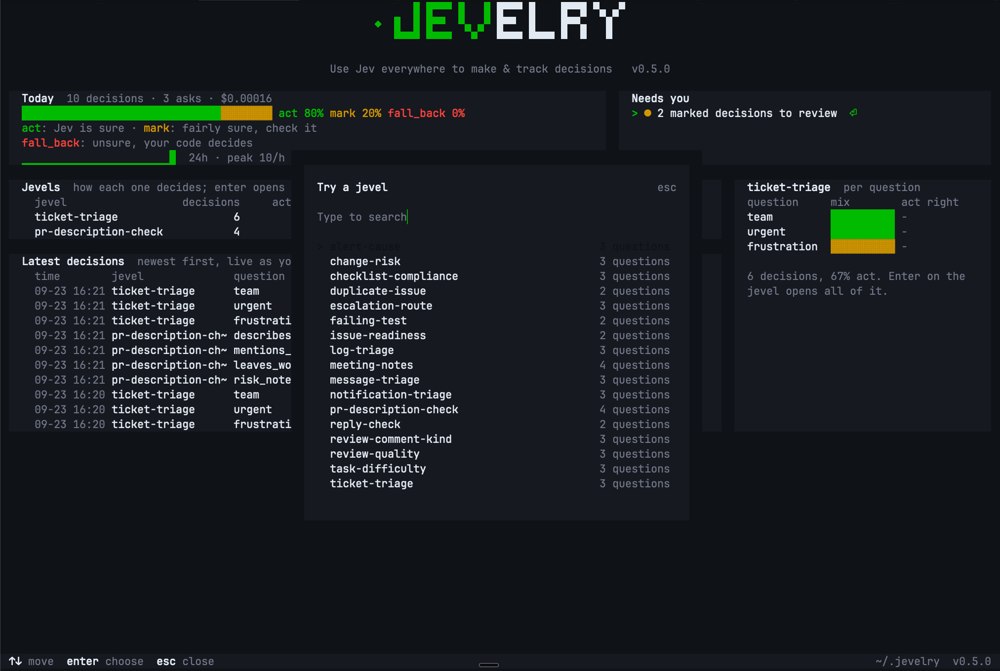

<p align="center">
  <a href="#overview">Overview</a> ·
  <a href="#installation">Install</a> ·
  <a href="#usage">Usage</a> ·
  <a href="#command-line-reference">Commands</a> ·
  <a href="#keyboard-shortcuts">Keys</a> ·
  <a href="#jevels">Jevels</a> ·
  <a href="#configuration">Configuration</a> ·
  <a href="https://docs.typesafe.ai">Jev docs</a>
</p>

<p align="center">
  
  
  
  
</p>

<p align="center"><b>Use Jev everywhere to make &amp; track decisions.</b></p>

<p align="center"></p>

jevelry lets your code and your coding agent ask Jev, the decision model from TypeSafe, a small typed question and get back a decision it can act on, and it keeps every decision so you can see how often Jev was right.

## Overview

Your code and your coding agent make the same small calls every day: is this ticket urgent, which team should get it, is this bug a duplicate, did this test fail because of the code or because of the machine it ran on. Today each of those is usually a prompt that returns text you parse, and you don't learn how sure the model was.

With jevelry you ask each of those questions to Jev with one command. A question lives in a small file called a jevel, and seventeen ready-made jevels ship with the package. Jev answers with how sure it is, and the jevel turns that into one of three decisions:

| Decision | Meaning | What your code does |
|---|---|---|
| `act` | Jev is sure | uses the answer |
| `mark` | Jev is fairly sure | uses the answer and flags it for a person |
| `fall_back` | Jev is unsure | does what it did before jevelry |

One ticket triage is about 1,280 input tokens at $0.042 per million, roughly $0.00005, so a dollar covers around 18,000 of them. jevelry itself is free and MIT, and TypeSafe charges only for input tokens.

### Where it helps

**In your app.** A support ticket comes in and needs a team and a priority. On `act` your code routes it to the team Jev picked, on `mark` it routes it and flags it for the queue owner, and on `fall_back` it leaves the ticket for a person, the same way it works today:

```sh
npx jevelry ask ticket-triage --state '{"ticket": {"subject": "Charged twice", "message": "I was billed twice this month, please refund one today."}}'
```

**In your coding agent.** A test fails with `connect EPERM` because the sandbox blocked a network call, and left alone your agent will probably start rewriting code that was fine. With the jevelry skill installed it asks first, and on `environment` it reports the sandbox problem and leaves your code alone:

```sh
npx jevelry ask review-comment-kind --state '{"comment": {"author": "ci-bot", "text": "FAIL tests/api.test.ts\nTypeError: fetch failed\n  cause: Error: connect EPERM 104.18.2.1:443"}}'
```

## Features

- **Seventeen jevels ship with the package**: support tickets, messages, issues, pull requests, logs, alerts, failing tests and meeting notes, each with an example state and tested cases.
- **Typed decisions in your code**: `jevel("ticket-triage").decide({ ticket })` gives you every question with its `decision` and its `answer`.
- **Commands Jev picks**: `jevelry run` runs the command a jevel names for the option Jev picked, and asks you first on a `mark`.
- **A full-screen view**: `jevelry tui` has Home, Review, a Jevel screen per jevel with threshold tuning, Try and History.
- **Every decision in one log**: each ask goes into `~/.jevelry/log.jsonl`, and `jevelry report` shows you how often each question was right.
- **Cases proven live**: every shipped jevel has a `cases.json`, and our live tests ask every case against the real API.
- **A skill for your coding agent**: `jevelry install` puts the skill into Claude Code, Codex, Cursor, opencode and pi.
- **Typed answers**: `jevelry types` writes a declaration file, so your editor knows the options of every jevel.

## Installation

jevelry runs on Node 22 or newer, so check `node --version` first.

### Using npm, on your machine

```sh
npm install -g jevelry
jevelry install
```

`jevelry install` puts the skill into every coding agent it finds and asks for your TypeSafe key. You can skip the key with Enter and add it later. Get a key at https://docs.typesafe.ai.

### As a library in your project

```sh
npm install jevelry
```

### In your coding agent

Run this inside Claude Code, Codex, pi, opencode or Cursor, or in your terminal:

```sh
npx jevelry install
```

If you prefer the skills installer, `npx skills add backant-io/jevelry --skill jevelry` does the same for the agents it supports.

### From source

```sh
git clone https://github.com/backant-io/jevelry.git
cd jevelry
npm install
npm run build
node bin/jevelry.js --help
```

## Usage

### Start

```sh
jevelry tui
```

It opens on Home, which shows you how Jev decided today, what needs you and how each of your jevels is doing. When your log is still empty, Home offers you a sample ticket: press enter to open it in Try and enter again to ask Jev about it live, and you see your first answer in a few seconds. If you have no key yet, Try tells you how to add one.

### Ask from the command line

```sh
export TYPESAFE_API_KEY=...
npx jevelry ask ticket-triage --state '{"ticket": {"subject": "Charged twice", "message": "I was billed twice this month, please refund one today."}}'
```

You get one JSON document back with an answer per question, and the part your code reads is the decision:

    "team":        { "choice": "billing",  "confidence": 1.0,  "decision": "act"  }
    "urgent":      { "noul": 0.98,         "yes": true,        "decision": "act"  }
    "frustration": { "score": 0.24,        "confidence": 0.64, "decision": "mark" }

The whole document and a `jq` one-liner are in [docs/examples.md](docs/examples.md).

### In your program

When the decision happens inside your own code, you load the jevel once when your program starts and call `decide` at the point where your code decides today:

```ts
import { jevel } from "jevelry";

const triage = jevel("ticket-triage");

const d = await triage.decide({ ticket });
switch (d.team?.decision) {
  case "act": route(ticket, d.team.answer); break;
  case "mark": route(ticket, d.team.answer); flagForQueueOwner(ticket); break;
  case "fall_back": leaveInGeneralQueue(ticket); break;
}
```

`decide` asks Jev, writes the ask to your log and hands you every question with its `decision` and its `answer`. When Jev can't answer, because TypeSafe is busy or your network is down, every question comes back `fall_back` with the reason in `d.error`, so your code just keeps its old path. Run `npx jevelry types --out src/jevels.d.ts` once and `d.team.answer` is typed as `"billing" | "technical" | "account" | "other"`.

### Let Jev run the command

When the next step after a decision is always one of a few commands, you put those commands into the jevel and jevelry runs the one Jev picks. `failing-test` ships with the package and works this way:

```sh
npx jevelry run failing-test --dry-run --state '{"test": {"name": "checkout > pays with a saved card", "output": "TimeoutError: waiting for selector failed: timeout 5000ms exceeded", "history": "fails about once a week and passes on a rerun"}}'
```

| Decision | What happens |
|---|---|
| `act` | the command runs |
| `mark` | jevelry asks you first, and `--yes` runs it straight away |
| `fall_back` | the jevel's `fall_back` command runs |

`--dry-run` prints what would run. Your state goes to the command on stdin and in the file `JEVELRY_STATE` points at, so a ticket that says `; rm -rf ~` stays plain text. jevelry prints the path of the jevel on stderr before it runs anything, because a `jevels/` folder in your project comes before the ones that ship.

### Use it with your coding agent

You probably want your coding agent to write the jevel and wire it in, while you review the questions. Once the skill is installed, talk to your agent the way you would to a colleague who has read the guide:

    Using the jevelry skill, write a jevel that decides which team a support ticket goes to
    and whether it is urgent, run check on it, and wire the decisions into src/inbox.ts.

The skill keeps every jevel in `./jevels/` and leaves the questions and thresholds for you to read. The guide the agent reads is [skills/jevelry/references/writing-jevels.md](skills/jevelry/references/writing-jevels.md) and works for people too.

## Command-line reference

| Command | What it does |
|---|---|
| `jevelry ask [jevel]` | asks every question of a jevel (or of `--questions`) about a state and prints one JSON document |
| `jevelry run <jevel>` | asks a jevel whose options name commands, then runs the command for Jev's decision |
| `jevelry outcome <log_id> <question> <value>` | records what proved true: `agree`, `disagree`, an option, a level index, `yes` or `no` |
| `jevelry report` | agreement per jevel and question, from the log |
| `jevelry tui` | the full-screen view: Home, Review, Jevel, Try and History |
| `jevelry list` | every jevel jevelry can find, with its folder; the first folder wins |
| `jevelry show <jevel>` | the resolved frontmatter as JSON, then the body, then `example.json` when the jevel has one |
| `jevelry check <jevel>` | refuses a defective jevel with exit 2 and warns about questions Jev handles poorly |
| `jevelry types` | writes a TypeScript declaration so `jevel(name).decide()` returns each jevel's own answer types |
| `jevelry models` | the model names your account may send, from `GET /v1/models` |
| `jevelry install` | installs the skill into your coding agents, then stores a TypeSafe key |
| `jevelry install-skill` | installs the skill into your coding agents, and asks for no key |
| `jevelry help [command]` | the help of one command |

`-V, --version` prints the version and `-h, --help` prints the help, on the program and on every command. A `<source>` is `@file`, `-` for stdin, or inline JSON.

### `ask`

| Flag | What it does |
|---|---|
| `--state <source>` | the state to ask about; required |
| `--questions <source>` | the API's questions map, for a one-off ask with no jevel |
| `--model <id>` | the model, over the jevel's pin and `JEVELRY_MODEL` |
| `--jevels <dir>` | a jevels folder searched first; repeatable |
| `--no-log` | keeps this ask out of the log |
| `--log-state` | writes the state itself into the log line, next to its hash |

### `run`

| Flag | What it does |
|---|---|
| `--state <source>` | the state to ask about; required |
| `--yes` | runs a `mark` straight away |
| `--dry-run` | prints what would run and runs nothing |
| `--model <id>` | the model, over the jevel's pin and `JEVELRY_MODEL` |
| `--jevels <dir>` | a jevels folder searched first; repeatable |
| `--log-state` | writes the state itself into the log line, next to its hash |

### `outcome`

| Flag | What it does |
|---|---|
| `--note <text>` | a sentence kept with the outcome |

### `report`

| Flag | What it does |
|---|---|
| `--jevel <name>` | only this jevel |
| `--since <iso>` | only asks at or after this time |
| `--json` | machine-readable rows |

### `tui`

| Flag | What it does |
|---|---|
| `--jevel <name>` | opens History filtered to this jevel |
| `--since <iso>` | opens History filtered to asks since this time |
| `--jevels <dir>` | a jevels folder searched first; repeatable |

`tui` needs an interactive terminal and exits 1 in a pipe.

### `list`, `show`, `check`

| Flag | What it does |
|---|---|
| `--jevels <dir>` | a jevels folder searched first; repeatable |

### `types`

| Flag | What it does |
|---|---|
| `--jevels <dir>` | a jevels folder searched first; repeatable |
| `--out <file>` | writes the declaration to this file; stdout by default |

### `install`, `install-skill`

| Flag | What it does |
|---|---|
| `--project` | installs into this project (`.claude/skills` and `.agents/skills`) |
| `--agent <names...>` | only these agents: `claude-code`, `codex`, `cursor`, `opencode`, `pi`, or `agents` with `--project` |
| `--no-key` | `install` only: installs the skill and asks for no key |

## Keyboard shortcuts

The footer shows the keys of the screen you are on, and `?` lists them all.

### Global

| Key | Action |
|---|---|
| `h` | Home |
| `v` | Review |
| `y` | History |
| `t` | pick a jevel to try |
| `ctrl+p` | command palette: screens, theme, help, quit and every jevel |
| `?` | help |
| `q` | quit; asks first when a state you edited in Try would be lost |

`ctrl+p` works on every screen, also while you type. The other global keys pause while a screen takes typed text.

### Home

| Key | Action |
|---|---|
| `j` `k` or `↑` `↓` | move |
| `enter` | open the entry: the review queue, a jevel, a decision or the failed asks |
| `enter` on an empty log | try `ticket-triage` with a sample ticket |

### Review

| Key | Action |
|---|---|
| `c` | Jev is correct |
| `w` | Jev is wrong: a yes/no question records the other answer, a choice or score asks for the right one |
| `s` | skip this decision |
| `n` | write a note for the next `c` or `w` |
| `m` | switch between marked decisions and act decisions |
| `j` `k` or `↑` `↓` | scroll what Jev saw |
| `esc` | Home |

`c`, `w` and `s` count once a card has been up for 450 ms, and a held key records once.

| When | Key | Action |
|---|---|---|
| picking the right answer | `j` `k` or `↑` `↓` | move |
| picking the right answer | `enter` | record it |
| picking the right answer | `esc` | cancel |
| writing a note | `enter` | keep the note |
| writing a note | `esc` | drop the note |
| all reviewed | `m` | switch between marked and act decisions |
| all reviewed | `s` | show the skipped ones again |
| all reviewed | `esc` | Home |

### Jevel

| Key | Action |
|---|---|
| `j` `k` or `↑` `↓` | move between questions |
| `enter` | the question's decisions, in History |
| `T` | set the proposed act threshold in the jevel file, when there is one |
| `esc` | Home |

### Try

| Key | Action |
|---|---|
| `enter` | ask Jev live |
| `r` | ask again |
| `e` | edit the state |
| `p` | pick another jevel |
| `j` `k` or `↑` `↓` | scroll the answer |
| `esc` | Home |

While you edit the state, typing and pasting go into the text, the arrows, `home` and `end` move, `tab` adds two spaces, `enter` asks and `esc` stops editing.

### History

| Key | Action |
|---|---|
| `j` `k` or `↑` `↓` | move |
| `enter` | open the decision, where `c`, `w`, `n`, `j` `k` and `esc` work as in Review |
| `f` | cycle the decision filter |
| `J` | cycle the jevel filter |
| `o` | only decisions with no outcome yet |
| `x` | only failed asks |
| `r` | the report |
| `esc` | back |

In the report, `j` `k` scroll, `J` cycles the jevel and `esc` goes back to the list.

### Dialogs

| Dialog | Key | Action |
|---|---|---|
| commands, pick a jevel, theme | typing | filter the list |
| commands, pick a jevel, theme | `↑` `↓` or `ctrl+n` `ctrl+p` | move |
| commands, pick a jevel, theme | `enter` | choose |
| commands, pick a jevel, theme | `esc` | close |
| help | `esc`, `?` or `enter` | close |
| set threshold | `enter` | write the threshold, copying a shipped jevel into `./jevels` first |
| set threshold | `esc` | cancel |
| set threshold | `q` | quit |
| quit | `enter`, `q` or `y` | quit |
| quit | `esc` or `n` | stay |

## Jevels

A jevel is a folder with one `JEVEL.md` in it, the same way a skill for your coding agent is a folder with one `SKILL.md`. The frontmatter holds the questions, their options and the thresholds, and the body is what you and your agents read. Jev takes three kinds of question:

| Question | You ask | You get back |
|---|---|---|
| `choice` | which of these options | the option, a probability per option, a confidence |
| `score` | how much, on your own levels | a value between the levels, a probability per level, a confidence |
| `noul` | is this true | one probability, 0 to 1 |

Seventeen ship with the package, each with an `example.json` to ask it with and a `cases.json` of realistic states with the answer a person would give. The table with their questions and state keys is in [jevels/README.md](jevels/README.md).

| Jevel | When to use it |
|---|---|
| `alert-cause` | an alert fired and you want a first hypothesis |
| `change-risk` | a pull request before merge |
| `checklist-compliance` | a report that claims to follow a checklist |
| `duplicate-issue` | a new issue against the open ones |
| `escalation-route` | a request or incident in a shared inbox |
| `failing-test` | a failing test, with `jevelry run` |
| `issue-readiness` | an issue before it reaches the backlog |
| `log-triage` | a burst of log lines |
| `meeting-notes` | notes after a meeting |
| `message-triage` | an inbound message in mail or chat |
| `notification-triage` | a batch of notifications for one person |
| `pr-description-check` | a pull request description against its diff |
| `reply-check` | a reply, to close the thread or keep it open |
| `review-comment-kind` | a review comment or a failing test output |
| `review-quality` | a finished code review |
| `task-difficulty` | a task before you route it |
| `ticket-triage` | a new support ticket |

jevelry finds jevels in `--jevels <dir>`, then `JEVELRY_JEVELS`, then `./jevels`, then `$JEVELRY_HOME/jevels`, then the ones that ship, and the first one with the name wins. To write your own, copy the nearest folder into `./jevels`, change the `name`, rewrite the questions and run `npx jevelry check <name>` until it prints 0 warnings. `check` refuses what the API would refuse (more than 255 options, a threshold outside 0 to 1, a question with no instructions) and warns about a yes/no question whose "yes" means no, a double negative, options that carry different fields and a model that is not pinned. The whole method is in [skills/jevelry/references/writing-jevels.md](skills/jevelry/references/writing-jevels.md).

Then write a `cases.json` with at least three states from your own data: one clear one way, one clear the other way and one you would ask a colleague about. The clear cases should land on the right answer, and the unclear one should stay below `act`.

## Decisions and the log

| Decision | Meaning | What your code usually does |
|---|---|---|
| `act` | certainty at or above the act threshold | acts on the answer |
| `mark` | certainty at or above the mark threshold | acts and flags it for a person |
| `fall_back` | below the mark threshold, or Jev could not answer | what it did before jevelry |

A yes/no question's certainty is how far its probability sits from 0.5, and a choice or score uses the confidence Jev reports. The thresholds live in the jevel, per question, with `act: 0.9, mark: 0.7` when the jevel sets none, so a question that skips an expensive step can ask for a higher bar than one that only sorts a list.

### The answer document

`ask` prints one JSON document, protocol 2. Its schema is [docs/protocol/ask.schema.json](docs/protocol/ask.schema.json).

| Field | What it holds |
|---|---|
| `protocol` | `2` |
| `log_id` | the id of the log line, for `jevelry outcome`; `null` with `--no-log` |
| `jevel` | `name` and `version`; `null` for `--questions` |
| `model` | the model that answered |
| `state_hash` | `sha256:` of the state |
| `answers` | one entry per question: `type`, the value (`choice`, `score` or `noul`), the probabilities, `decision` |
| `usage` | input and output tokens |
| `run` | `jevelry run` only: the option, command, decision, exit, duration and whether you confirmed it |

On failure the document is `{ "protocol": 2, "error": { "exit", "code", "message" } }`, with `field` when a field is wrong and `retry_after_ms` when TypeSafe gave one.

### The log, outcomes and the report

Every ask goes into `$JEVELRY_HOME/log.jsonl` with its answers, its decisions and a hash of the state. The state itself goes in only with `--log-state`, `jevel(name, { logState: true })` or `JEVELRY_LOG_STATE=1`, because states often hold customer text, and an ask from Try always keeps its state. When you later know what was true, you tell jevelry:

    npx jevelry outcome <log_id> urgent yes
    npx jevelry report --jevel ticket-triage

    jevel          question     asks  act  mark  fall_back  outcomes  agree(act)  agree(mark)  certainty
    ticket-triage  frustration  1     0    1     0          0         -           -            0.64
    ticket-triage  team         1     1    0     0          0         -           -            1.00
    ticket-triage  urgent       1     1    0     0          1         100%        -            0.98

`agree(act)` is how often `act` was right, and that is the number you move a threshold by. For a question that repeats over a list, the question name carries the index, so you write `same_as[0]`.

### Tuning thresholds

Once a question has 20 reviewed decisions, the Jevel screen proposes a lower act threshold when the decisions above it were right at least 90% of the time and at least as often as at the current threshold, less two points. `T` writes it into the jevel file. A jevel that came with jevelry is first copied into `./jevels`, and from then on your project uses that copy.

## Configuration

### Environment variables

| Variable | What it does | Default |
|---|---|---|
| `TYPESAFE_API_KEY` | your key; read from the environment, then the macOS keychain, then `$JEVELRY_HOME/env` | required |
| `TYPESAFE_BASE_URL` | the API root, read by the SDK | `https://api.typesafe.ai` |
| `TYPESAFE_DEFAULT_MODEL` | the model the SDK sends when `--model`, the jevel and `JEVELRY_MODEL` name none | `jev-latest` |
| `TYPESAFE_LOG_LEVEL` | the SDK's log level; its lines go to stderr as `jevelry: sdk:` | the SDK's |
| `JEVELRY_MODEL` | the model when the jevel pins none | `TYPESAFE_DEFAULT_MODEL` |
| `JEVELRY_HOME` | where the log, the key file and the TUI settings live | `~/.jevelry` |
| `JEVELRY_JEVELS` | more jevel folders, colon separated | none |
| `JEVELRY_TIMEOUT_MS` | the request timeout, per attempt | `30000` |
| `JEVELRY_LOG_STATE` | `1` writes the state itself into each ask line, for `ask`, `run` and `decide` | off, only the hash |
| `JEVELRY_KEY_STORE` | `file` keeps the key in `$JEVELRY_HOME/env` on macOS too | the keychain on macOS |

The model an ask uses is the first one set of `--model`, the jevel's `model`, `JEVELRY_MODEL` and `TYPESAFE_DEFAULT_MODEL`.

A command started by `jevelry run` gets these, and `TYPESAFE_API_KEY` is removed from its environment:

| Variable | What it holds |
|---|---|
| `JEVELRY_STATE` | the path of a file with the state, removed afterwards |
| `JEVELRY_DECISION` | `act`, `mark` or `fall_back` |
| `JEVELRY_OPTION` | the option Jev picked, empty on `fall_back` |
| `JEVELRY_LOG_ID` | the id of the ask in the log |

### Where the key is stored

`jevelry install` stores the key in the macOS keychain (service `typesafe-api-key`, account `jevelry`) and on every other machine in `$JEVELRY_HOME/env` as `TYPESAFE_API_KEY=...`, readable only by you. A key that is already in the environment, the keychain or the file is left as it is.

### `$JEVELRY_HOME`

| Path | What it holds |
|---|---|
| `log.jsonl` | every ask, outcome and run, one JSON line each |
| `env` | the key, when the keychain is unavailable |
| `tui.json` | the TUI theme, `dark` or `light`, set from `ctrl+p` |
| `jevels/` | your own jevels for every project on this machine |

## When it fails

`ask` and `run` print one JSON document on stdout in every case. On failure it is an error document and the exit code says what happened:

| Exit | Meaning |
|---|---|
| 0 | answered |
| 1 | a usage error, `tui` outside a terminal, or anything the codes below leave out |
| 2 | the jevel or the state is wrong, and the document names the field |
| 3 | rate limited or overloaded, with `retry_after_ms` when TypeSafe gave one |
| 4 | the key is missing or refused, and no request was made |
| 5 | over the token budget, and no request was made |
| 6 | the network or TypeSafe's servers |
| 7 | TypeSafe answered a shape this build cannot read |
| 9 | `jevelry run` only: Jev marked the call and nobody confirmed it, so the command stayed put |

When `jevelry run` runs a command, it exits with that command's exit code.

## Architecture

| Module | What it does |
|---|---|
| `src/cli.ts`, `src/program.ts` | the entry and the commands, built with commander |
| `src/jevel.ts` | finds, parses and checks jevels, and expands a question that repeats over a list |
| `src/budget.ts` | estimates the tokens of a request before it is sent |
| `src/ask.ts` | one ask: checks the state, sends every question in one request, reads the answers |
| `src/decision.ts` | certainty and thresholds into `act`, `mark` or `fall_back` |
| `src/decide.ts` | the library: `jevel(name).decide()`, `.run()` and the client |
| `src/run.ts` | plans the command for a decision and runs it |
| `src/log.ts` | the log, outcomes and runs |
| `src/report.ts` | agreement per question |
| `src/key.ts`, `src/install.ts` | the key store and the skill installer |
| `src/protocol.ts` | the answer document and the exit codes |
| `src/tui/` | the full-screen view, built with ink |

An ask flows like this: the jevel is found and checked, the state is checked against the jevel's required keys, questions that repeat over a list are expanded, the request is estimated against the budget, and then the official `@typesafe-ai/sdk` sends every question in one request. Each answer is checked against its question, turned into a decision by the thresholds and written to stdout, and the ask is appended to the log.

## Development

### Prerequisites

- Node 22 or newer
- a TypeSafe key, for the live tests only

### Build and test

```sh
git clone https://github.com/backant-io/jevelry.git
cd jevelry
npm install
npm run build
npm test
npm run lint
```

`npm test` builds first and runs the offline suite against recorded answers. The live suite asks the real API with the key from your environment:

```sh
export TYPESAFE_API_KEY=...
npm run test:live
npm run test:live -- tests/live/jevels.test.ts
```

## How do we know you can trust it

357 tests run offline against recorded answers from TypeSafe's API reference, against the seventeen jevels and their cases, and against every screen of `jevelry tui` at 80x24 and 120x40. 99 tests run against the real API on demand with `npm run test:live`: every jevel answers its own `example.json`, every case in every `cases.json` gets the answer it expects, five more cover the API itself, one routes the `ticket-triage` example through `decide` in your program, one asks `ticket-triage` from the Try screen of `jevelry tui` and one lets `failing-test` run its command. One of those tests reads the log afterwards and checks that your key stays out of it.

## License

MIT. See [LICENSE](LICENSE).

## Contributing

Issues and pull requests are welcome at https://github.com/backant-io/jevelry. Run `npm test` and `npm run lint` before you open one, and when you add a jevel, give it an `example.json` and a `cases.json` and run its cases with `npm run test:live -- tests/live/jevels.test.ts`.
